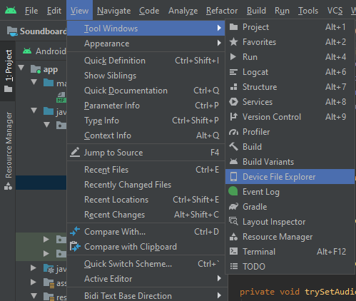
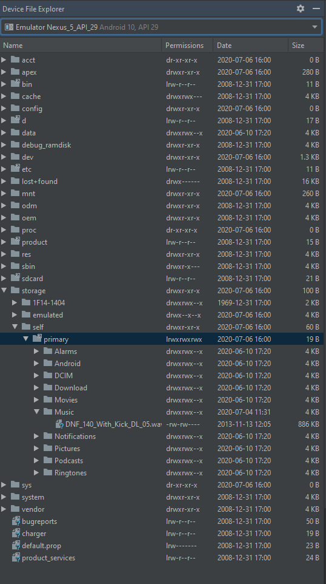

# NavDrawer 
- https://guides.codepath.com/android/Fragment-Navigation-Drawer
___
        - implementation 'com.google.android.material:material:1.0.0'
        - Create menu with a Toolbar
        - Disable default Toolbar to use as ActionBar in styles.xml
        - Create drawer layout file with androidx.drawerlayout.widget.DrawerLayout as root
        - Add code to enable nav drawer functionality

    Optional:
        NavDrawer Header:
    
        Create nav header layout for NavigationView to reference (in activity_main)
        
    Hamburger icon:
    
        Add code to change icon to animated hamburger menu
        
    Translucent Status Bar: 

        name="android:windowTranslucentStatus">true in styles.xml
     

# Fragments 
- https://www.tutorialspoint.com/android/android_fragments.htm#:~:text=A%20Fragment%20is%20a%20piece,its%20own%20life%20cycle%20callbacks.
- https://www.tutorialspoint.com/android/android_single_fragments.htm
- https://developer.android.com/training/basics/fragments/communicating.html
___
        - implementation "android.arch.lifecycle:extensions:2.0.0"
        - implementation "androidx.lifecycle:lifecycle-common-java8:2.0.0"  (Java 8 req)
        - Create empty fragment + layout
        - Include fragments in host layout (eg.activity_main)
            *note: Using FrameLayout to swap fragments instead
        -Pass data between fragments using ViewModel and LiveData

# ViewModel and LiveData
- https://developer.android.com/topic/libraries/architecture/viewmodel
- https://heartbeat.fritz.ai/passing-data-between-fragments-on-android-using-viewmodel-d47fa6773f9c
- https://www.youtube.com/watch?v=ACK67xU1Y3s
___
        - create a ViewModel to interface between fragments
        - instantiate MutableLiveData<?> object in constructor to avoid reinstantiating and clearing data
        - get/set to alter live data object value
        - set an observer in fragment to listen for changes in ViewModel
        - access the setter 'ViewModel.setMethod(newValue)' where setter contains MutableLiveData<?>.setValue(newValue) to 


# AssetManager (use assets included with APK)
- http://developer.android.com/reference/android/content/res/AssetManager.html
- https://xjaphx.wordpress.com/2011/10/02/store-and-use-files-in-assets/
___
        - getAssets is an object of AssetManager
        - get file path of assets
                - context().getAssets().list(path), where path is "" for root of assets directory (app/assets/)
        - get assetFileDescriptor
                - context().getAssets().openFd(pathOfAssets)
        - use as data source


# MediaPlayer
- https://developer.android.com/training/data-storage/shared/media
- https://stackoverflow.com/questions/30100083/how-to-play-audio-file-in-android-from-internal-memory-of-phone
___
        - MediaPlayer should be a global variable, or else garbage collection will dispose before audio is finished
        - MediaPlayer.setDataSource()
                - assetFileDescriptor.getFileDescriptor(), assetFileDescriptor.getStartOffset(), assetFileDescriptor.getLength() or
                - context(), uri
        - MediaPlayer.prepare() or MediaPlayer.prepareAsync()
        - MediaPlayer.start()
                - can use .stop() to stop early, but must prepare MediaPlayer again before you can start again
        - .release() MediaPlayer instances when finished to release resources, then set to MediaPlayer to null


# Accessing external storage for uri
- https://developer.android.com/training/data-storage/shared/documents-files
- https://developer.android.com/training/data-storage/shared/media#java
- https://commonsware.com/blog/2016/03/15/how-consume-content-uri.html
- https://developer.android.com/reference/android/content/ContentResolver#openFileDescriptor(android.net.Uri,%20java.lang.String)
- https://stackoverflow.com/questions/5568874/how-to-extract-the-file-name-from-uri-returned-from-intent-action-get-content
- https://stackoverflow.com/questions/58430070/android-apiv29-filenotfoundexception-eacces-permission-denied
___
        - In manifest, get permission: READ_EXTERNAL_STORAGE
        - In code, ask user for permission (for api23+ devices)
        - *Warning* Android 4.4+ returns a different format uri when using Intent.ACTION_GET_CONTENT
        - *Warning* Android 10+ has scoped storage access, cannot read/write files from/to external storage directly
        - get permission
        - startActivityForResult on an Intent.ACTION_GET_CONTENT (allows user to choose file)
        
```Java
mUploadFileIntent = new Intent(Intent.ACTION_GET_CONTENT);
mUploadFileIntent.addCategory(Intent.CATEGORY_OPENABLE);
mUploadFileIntent.setType("audio/*");
startActivityForResult(Intent.createChooser(mUploadFileIntent, getText(R.string.upload_audio_file)), REQUEST_CODE);
```

        *setType is the MIME-type you are looking for. Here I am looking for audio types of any (*) file extension

        - obtain results in onActivityReult method
        - check result code and request codes

        - API < 19: use MediaStore.Audio.Media.DATA 
                - cursor to search for the DATA column from MediaStore to get file name

        - API >= 19: cannot use MediaStore.Audio.Media.DATA anymore, comes back null (new uri format possibly incompatible)
                - cursor on getContentResolver() query for OpenableColumns.DISPLAY_NAME to get file name

        - API 29+: cannot read path of file
                - save MediaPlayer.setDataSource(context, uri) instead


# MediaRecorder 
- https://developer.android.com/guide/topics/media/mediarecorder
___
        - In manifest get permission: RECORD_AUDIO
        - In code, ask user for permission
        - MediaRecorder.setAudioSource(MediaRecorder.AudioSource.MIC)
        - MediaRecorder.setOutputFormat(MediaRecorder.OutputFormat.THREE_GPP)  (this file format was used in documentation)
        - MediaRecorder.setAudioEncoder(MediaRecorder.AudioEncoder.AMR_NB)    (used in documentation)

        - API 26+: MediaRecorder.setOutputFile(destinationPath, fileName)
        
        - MediaRecorder.setOutputFile(path + "/" + fileName)
        - MediaRecorder.prepare()
        - MediaRecorder.start()
        - MediaRecorder.stop()
        - MediaRecorder.Release()
        - MediaRecorder = null


# Accessing internal storage for uri (Uri.fromFile and FileProvider)
- https://developer.android.com/reference/androidx/core/content/FileProvider
___
        - API < 26: use Uri.fromFile(File)
                - thats it
        
        - Using FileProvider to get content uri
                - in res/xml create an xml with:
```Java
<paths xmlns:android="http://schemas.android.com/apk/res/android">
	*<files-path name="name" path="path"/>
</paths>
```
                - where name is any name (used to hide true path) and path is subdirectory in files/, if not accessing a subdirectory, path="/"
                - in manifest > application, set a: 
```Java
<provider
	android:authorities="yourdomainhere.fileprovider"
	android:name="androidx.core.content.FileProvider"
	android:exported="false"
	android:grantUriPermissions="true">
		<meta-data
			android:name="android.support.FILE_PROVIDER_PATHS"
			android:resource="@xml/file_paths" />
</provider>
```
                - In code:
```Java
uri = FileProvider.getUriForFile(context, "yourdomainhere.fileprovider", File)
```

        *files-path is exclusively for internal storage, use external-path for external storage
        **yourdomainhere = build.gradle app -> applicationId


##  Simple example of grabbing audio file from internal storage and playing it
___
Step 1: Putting files into internal storage

        - View > Tool Windows > Device File Explorer


        - storage > self > primary > Music
        - Right-click the folder and select upload

        
        * Note: Device File Explorer requires an emulator to be running to access its files

Step 2: Have user pick the file on button press

```Java
final int UPLOAD_REQUEST_CODE = 1;

onClickListener...{
...
	Intent mUploadFileIntent = new Intent(Intent.ACTION_GET_CONTENT);
	mUploadFileIntent.addCategory(Intent.CATEGORY_OPENABLE);
	mUploadFileIntent.setType("audio/*");
	startActivityForResult(
		Intent.createChooser(
			mUploadFileIntent,
			"Select an audio file."),
			UPLOAD_REQUEST_CODE
	);
}
```
        * setType refers to a MIME-type, * is wildcard, request code is any integer


Step 3: Grab data from user selected file

```Java
Uri uri;

@Override
public void onActivityResult(int requestCode, int resultCode, @Nullable Intent data) {
	super.onActivityResult(requestCode, resultCode, data);
    if (resultCode == RESULT_OK) {
            switch (requestCode) {
                case UPLOAD_REQUEST_CODE:
                uri = data.getData();
                break;
            }
        }
}
```

Step 4: Play audio once prepared, stop and reset if playing

```Java
 MediaPlayer mediaPlayer = new MediaPlayer();

onClickListener...{
...
if (!mediaPlayer.isPlaying()) {
	try {
		mediaPlayer.setDataSource(this, mUri);
	} catch (IOException e) {
		e.printStackTrace();
	}
	mediaPlayer.prepareAsync();
	mediaPlayer.setOnPreparedListener(new MediaPlayer.OnPreparedListener() {
		@Override
		public void onPrepared(MediaPlayer mp) {
			mediaPlayer.start();
		}
	});
} else {
	mediaPlayer.stop();
	mediaPlayer.reset();
}
```


## Color locations:
___
R/layout
- styles.xml

R/values
- nav_header.xml

fragments
- background
- image buttons
- imageButton.backgroundColor
